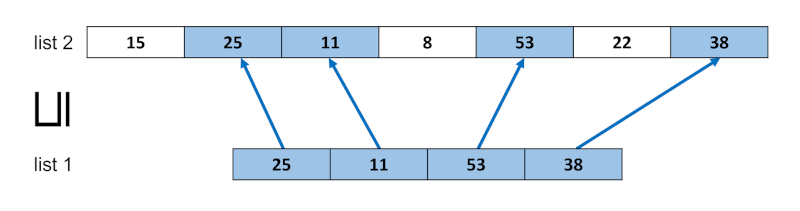

# Lab 1: Introduction to stainless

This first lab is comprised of two parts. In the first, you will use stainless to verify a short scala file. In the second, you will implement some simple but useful functions on propositional formulas

## Installation

### Java Development Kit
In order to run stainless, as well as the programs you will verify, you will need **Java 17**.

You can check your Java version using 
```shell
> java -version
openjdk version "17.0.9" 2023-10-17
OpenJDK Runtime Environment Temurin-17.0.9+9 (build 17.0.9+9)
OpenJDK 64-Bit Server VM Temurin-17.0.9+9 (build 17.0.9+9, mixed mode, sharing)
> javac -version
javac 17.0.9
```
The exact version might vary, but the major version should be 17.

On some Linux distributions, a command exists to change your "active" JDK if multiple ones are installed on your machine. Examples include:
- **Debian-based:** `update-alternatives -config java`;
- **[ArchLinux-based](https://wiki.archlinux.org/title/Java#Switching_between_JVM):** `archlinux-java set java-17-openjdk`.

### Scala
You will also need a way to compile scala programs.
We will provide files meant to be used with [scala-cli](https://scala-cli.virtuslab.org/install/) while working with stainless, but you will also need [sbt](https://www.scala-sbt.org/) when working with [LISA](https://github.com/epfl-lara/LISA) in future labs.
As such, we recommend that you install [coursier](https://get-coursier.io/), which will come with the scala compiler, scala-cli and sbt.
Install instructions can be found [here](https://get-coursier.io/docs/cli-installation).

You will need to add coursier's `bin` directory to your path. The `bin` directory's path (typically `~/.local/share/coursier/bin` on Linux) will be printed in the terminal near the end of the installation.

You can test your installation with
```shell
> scala -version
Scala code runner version 3.3.1 -- Copyright 2002-2023, LAMP/EPFL
> scala-cli -version
Scala CLI version: 1.5.0
Scala version (default): 3.5.0
> sbt -version
sbt version in this project: 1.9.8
sbt script version: 1.9.8
```

### Stainless
Download the latest stainless release from its [repository](https://github.com/epfl-lara/stainless/releases/tag/v0.9.8.8). 

On Windows, it is recommended to run the linux version on top of the Windows Subsystem for Linux (WSL 2).

The release is an archive containing, among other things, a script called **stainless**, that you should make available on your path. Detailed instructions can be found in [this video](https://mediaspace.epfl.ch/media/01-21%2C%20Stainless%20Tutorial%201_4/0_h1bv5a7v). 

On Mac, you should also make the `z3` executable (which is part of the stainless release) available on your path.

Stainless should then produce the following output (you may need to add `.sh` or `.bat` after `stainless`)
```shell
> stainless --version
[  Info  ] Stainless verification tool (https://github.com/epfl-lara/stainless)
[  Info  ]   Version: 0.9.8.8
[  Info  ]   Built at: 2024-08-22 13:43:47.647+0200
[  Info  ]   Stainless Scala version: 3.3.3
[  Info  ] Inox solver (https://github.com/epfl-lara/inox)
[  Info  ] Version: 1.1.5-166-gca9e9e8
[  Info  ] Bundled Scala compiler: 3.3.3
```

## Tutorial

A basic tutorial on stainless can be found [here](https://epfl-lara.github.io/stainless/tutorial.html). Additionally, some older videos can be found on the [repository](https://github.com/epfl-lara/stainless/#further-documentation-and-learning-materials). In particular, illustrative examples are in the [bolts/tutorials](https://github.com/epfl-lara/bolts/tree/master/tutorials)  including those from the [FMCAD 2021 tutorial](https://github.com/epfl-lara/fmcad2021tutorial). The beginning of [ASPLOS 2022 tutorial](https://epfl-lara.github.io/asplos2022tutorial/) may be of interest as well. Some of the [verified examples in Stainless source directory](https://github.com/epfl-lara/stainless/blob/main/frontends/benchmarks/verification/valid/) are interesting, such as  [BalancedParentheses.scala](https://github.com/epfl-lara/stainless/blob/main/frontends/benchmarks/verification/valid/BalancedParentheses.scala), [associative list](https://github.com/epfl-lara/stainless/blob/main/frontends/benchmarks/verification/valid/AssociativeList.scala).

To have a bit more intuition for how to do induction proofs, consider the following arithmetic example that verifies in Stainless:

```scala
def sumTo(n: BigInt): BigInt =
  require(0 <= n)
  if n == 0 then BigInt(0)
  else n + sumTo(n-1)    

def sumToIsCorrect(n: BigInt): Unit = {
  require(0 <= n)
  if n == 0 then ()
  else sumToIsCorrect(n-1)
} ensuring { _ => sumTo(n) == n*(n+1)/2 }
```

Whereas we could have modified `sumTo` to state the postcondition `res == n*(n+1)/2`, here we decided to leave `sumTo` as is. To ensure that Stainless proves property by induction, we repeat the recursive structure of `sumTo` inside the body of `sumToIsCorrect`. The result is the same induction schema as if we added apostcondition to `sumTo`. Simple cases of such induction can be simulated by adding `induct` annotation to the original method, but writing explicitly induction schema as we did here is more general.

### Getting the source

To start working on this lab, you can either clone this entire repository, or download the present directory alone from Gitlab (there should be a button for this on the top right of the web interface).

## Lab, part 1

### The `sublist` relation

The file `Sublist.scala` (in this directory) defines a relation `sublist` on lists, also noted $`\sqsubseteq`$, which holds when all the elements of the first list appear in the second in the same order. Some examples:
```math
\newcommand{\slist}[0]{\sqsubseteq}
\newcommand{\seq}[1]{\langle#1\rangle}
\begin{align*}
    \seq{0,2} &\slist \seq{0,1,2} \\
    \seq{0,0,2} &\not\slist \seq{0, 2}\\
    \seq{1,0} &\not\slist \seq{0,0,1} \\
    \seq{10,5,25} &\slist \seq{70,10,11,8,5,25,22}
\end{align*}
```


The file includes a main function which checks the examples above
```shell
> scala-cli run Sublist.scala
<0,2> ⊑ <0,1,2> = true
<0,0,2> ⊑ <0,2> = false
<1,0> ⊑ <0,0,1> = false
<10,5,25> ⊑ <70,10,11,8,5,25,22> = true
<25,11,53,38> ⊑ <15,25,11,8,53,22,38> = true
```

### Goal of the lab

The `List` data-structure as well as the `sublist` relation are already implemented; your job is now to prove some properties on the latter, such as reflexivity, transitivity, and antisymmetry. 
These properties are stated in the form of functions which "do nothing": they return `Unit` and have no effects.
You have to fill these functions with a proof of their statement.

As an example, the first property to prove is reflexivity. It is stated as follows 
```scala
def reflexivity[T](l: List[T]): Unit = {
  /* TODO: Prove me */
}.ensuring(_ =>
  sublist(l, l)
)
```
which should be understood mathematically as
```math
\newcommand{\slist}[0]{\sqsubseteq}
\newcommand{\seq}[1]{\langle#1\rangle}
\forall l,\  l \slist l
```
Another example: transitivity
```scala
def transitivity[T](l1: List[T], l2: List[T], l3: List[T]): Unit = {
  require(sublist(l1, l2) && sublist(l2, l3))
  /* TODO: Prove me */
}.ensuring(_ =>
  sublist(l1, l3)
)
```
which should be interpreted as
```math
\newcommand{\slist}[0]{\sqsubseteq}
\newcommand{\seq}[1]{\langle#1\rangle}
\forall l_1\, l_2\, l_3,\ l_1 \slist l_2 \land l_2 \slist l_3 \implies l_1 \slist l_3
```

The file contains eleven properties on `sublist` that you have to prove.

To check your proofs, use
```shell
# On Linux and WSL
> stainless src/Sublist.scala
# On Mac
> stainless --solvers=smt-z3 src/Sublist.scala
``` 


The provided configuration file ([stainless.conf](stainless.conf)) will automatically set the SMT solver's timeout to 2 seconds.
You can override this while experimenting with your proofs by either changing the configuration file or using the command line, by adding e.g. `--timeout=5` to set the timeout to 5 seconds.
You can also add `--watch` for stainless to automatically run on file save:
```shell
> stainless --timeout=5 --watch src/Sublist.scala
```

You are not allowed to change the definition of `sublist` or the statement (parameters/return types, function name, requirements, conclusion, ...) of any of the properties.
The only exception to this rule is the `@induct` annotation, which you are allowed to add to any parameter.

Some advice:
- Try to understand how you would prove these properties with paper and pencil, and use examples to gain intuition;
- Induction is the main proof method in many cases; see the videos on how to write inductive proofs;
- Prove lemmas in order: earlier lemmas (and their structure) will help you with subsequent lemmas;
- Even though it is not necessary, you can define new lemmas if it helps (but you then have to prove them correct as well 😊);
- Regarding the four lemmas about concatenation: two very similar lemmas can have vastly different proofs (in both size and difficulty – can you tell why ?).

## Lab, part 2
In the second part, you have to implement 9 functions on propositional formulas.
In the `BooleanAlgebra.scala` file, you will fine first the definition of `Formula` as an Algebraic Data Type (ADT): a boolean`Formula` is either
- A variable `Var(id)`, identified by a unique integer
- A formal conjunction `And(left, right)`, where `left` and `right` are formulas
- A formal disjunction `Or(left, right)`, where `left` and `right` are formulas
- A formal implication `Implies(left, right)`, where `left` and `right` are formulas
- A formal negation `Not(formula)`, where `formula` is a formula
- The constant`True` constant,
- The constant `False` constant,

You have to implement the functions marked by `???` in the file. To help you understand what the function should do, you can find examples of input-output pairs in the `test/Tests.scala` file.
- `eval` Evaluates a formula under a given assignment of boolean values to variables.
- `substitute` replaces occurences of variables in a formula by corresponding formulas.
- `nnf` Transforms a formula into its [Negation Normal Form](https://en.wikipedia.org/wiki/Negation_normal_form).
- `variables` Returns the set of all the variables in a formula.
- `validity` Checks if a formula is valid, i.e., if it is true under all possible assignments of boolean values to variables.

You then find the definition of formulas represented as [And-Inverter Graphs](https://en.wikipedia.org/wiki/And-inverter_graph) (AIGs). It so happens that this format, although more restricted, is complete, i.e. it can represent any formula. You have to implement the following functions:
- `AIG_eval`, `AIG_variables` and `AIG_validity` are similar to their counterparts for formulas, but for AIGs.
- `formulaToAIG` converts a formula in the usual representation to an AIG formula. Note that there may be multiple equivalent way to do this: You are only required that the input and output formulas are equivalent, i.e. that under any assignment of boolean values to variables, the two formulas evaluate to the same value.

Again, don't forget too look at the tests in `test/Tests.scala` to see example of how what your implementation should behave.

You can run the tests with
```shell
> scala-cli test .
```
When all tests pass successfuly, you are don!


## Submission

Once you've completed all proofs, you can submit your [Sublist.scala](Sublist.scala) and [BooleanAlgebra.scala](BooleanAlgebra.scala) files on [Moodle](https://moodle.epfl.ch/mod/assign/view.php?id=1092878).

You also need to pick your groups (min 2, max 3) for the labs and projects on [Moodle](https://moodle.epfl.ch/mod/questionnaire/view.php?id=1216793).

Only one member of each group should submit a solution. 


## Troubleshooting
- If, when running `scala-cli test .` you obtain an error of the form `Error: bloop.rifle.FailedToStartServerExitCodeException: Server failed with exit code 1`, try to run the command:
```shell
> eval "$(cs java --env --jvm temurin:17)"
```
